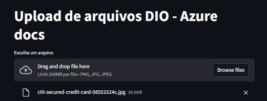

# Analise-de-documentos-Anti-fraude-com-Azure-AI-lab
Este projeto faz parte do Bootcamp da DIO e tem como objetivo demonstrar uma solução de análise automática de documentos para prevenção de fraude. Utilizando recursos de Azure AI Services, o sistema identifica informações relevantes em imagens enviadas pelo usuário, como possíveis dados de cartões ou documentos falsos, e retorna um relatório de validação.

A aplicação faz upload da imagem para um Azure Blob Storage, chama a API de Azure Document Intelligence para análise e exibe o resultado de forma simples e visual através de uma interface construída com Streamlit.


## ✅ Funcionalidades
- Upload de imagens (`.png`, `.jpg`, `.jpeg`)
- Armazenamento no Azure Blob Storage
- Processamento com Azure AI Document Intelligence
- Interface simples em **Streamlit**
- Exibição do resultado da validação

## 🧠 Tecnologias Utilizadas
- Python
- Streamlit
- Azure Blob Storage
- Azure Document Intelligence
- Azure Key Credential

## ▶️ Como Executar
1. Crie e ative o ambiente virtual
  ```bash
   python -m venv .venv
   source .venv/bin/activate   # Linux/Mac
   .venv\Scripts\activate      # Windows
  ```

2. Instale as dependências
  ```bash
    pip install -r requirements.txt
  ```

3. Configure as váriaveis de ambiente
  ```bash
  CONTAINER_NAME=
  SUBSCRIPTION_KEY=
  AZURE_STORAGE_CONNECTION_STRING=
  ENDPOINT=
  ```

4. Execute o sistema
  ```bash
  streamlit run app.py
  ```

📦 Estrutura Simplificada
 ```bash
/src
 ├── app.py
 ├── requirements.txt
 ├── services/
 │    ├── blob_service.py
 │    └── credit_card_service.py
 └── utils/
      └── config.py
```

## 🖼️ Resultado




